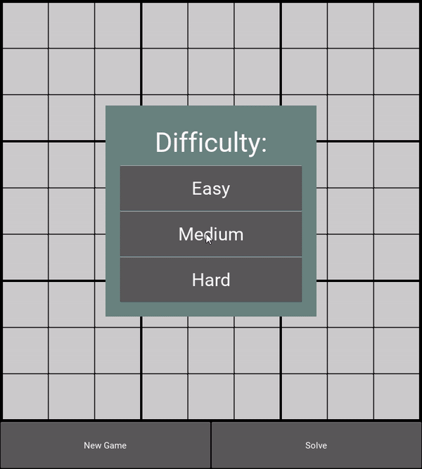
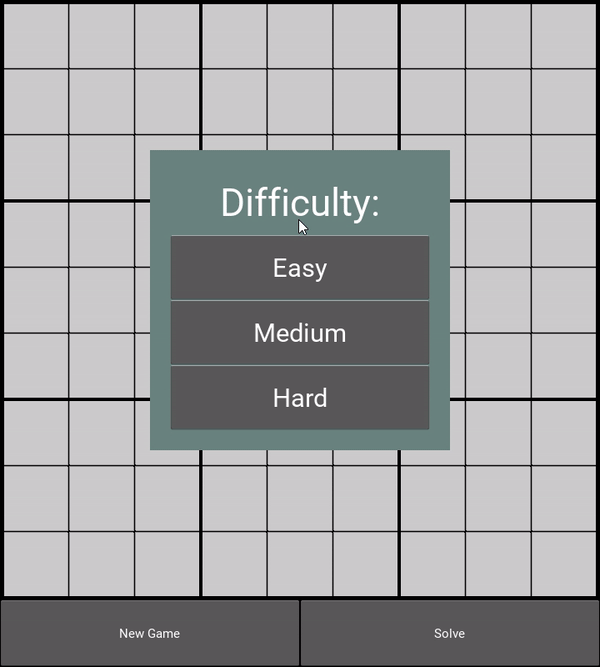
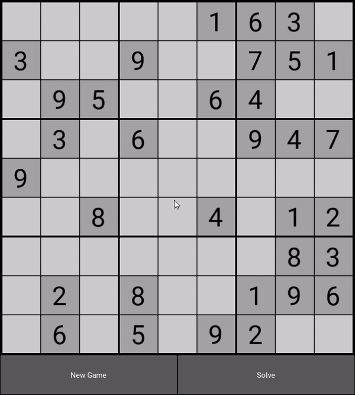

# Sudoku
A simple sudoku app made with Kivy Framework.

## Getting started
### Prerequisites
* Python 3.7+
* NumPy 1.18+
* Kivy 1.11+

### Running the app
Download the repository and launch game.py:
```
git clone https://github.com/Aidar-Shagiyev/Sudoku
cd Sudoku/game
python game.py
```

### Controls
* <kbd>LMB</kbd> to select a cell
* <kbd>1-9</kbd> to toggle pencil marks
* <kbd>Enter</kbd> to fill in the cell when only 1 pencil mark is present
* <kbd>Backspace</kbd> to clear the cell
* <kbd>Esc</kbd> to unselect the cell

## Features
### Basic
* Both row and column are highlighted for the selected cell.
* If the selected cell contains a filled in digit, all of the occurrences of the digit are highlighted.
* If a filled in digit causes a clash, all of the involved parties are highlighted.



### Board generation
The app is able to procedurally generate puzzles of varying difficulties (with different number of given digits). Each puzzle is guaranteed to have a unique solution.



### Auto-solver
The app also has an integrated solver. It first tries to fill in naked singles, and if it can't find one, then it starts to brute-force the puzzle with Depth-first search. 
It always selects the cell with the least amount of possible digits as a branching point. The branching points (the cells) are colored yellow.


